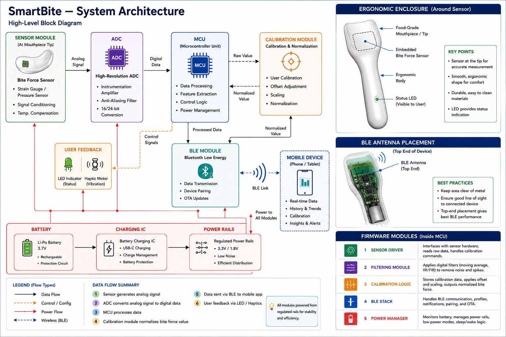

# SmartBite

**SmartBite is an experimental smart oral-health platform for sensing, feedback, and future automated cleaning prototypes.**

The project begins with a compact bite-force sensing mouthpiece: embedded force sensing, signal conditioning, microcontroller processing, calibration, Bluetooth Low Energy communication, and ergonomic enclosure design. This first module creates the technical foundation for later SmartBite prototypes that combine sensing, user feedback, and controlled oral-care mechanisms.

> Status: V0 prototype planning and architecture definition. This repository is for research, prototyping, and engineering documentation, not a finished consumer or medical product.



## What This Repository Contains

- **System architecture**: sensor, ADC, MCU, calibration, BLE, power, user feedback, and enclosure integration.
- **Bite-force sensing research**: candidate sensor types, signal behaviour, mechanical placement, and electrical integration.
- **Ergonomic design notes**: comfort, safety, hygiene, moisture protection, and mouthpiece constraints.
- **Firmware planning**: sampling loop, filtering, calibration logic, BLE services, and power management.
- **Prototype roadmap**: V0, V1, and future development milestones.

## Project Direction

SmartBite is being developed in stages:

| Stage | Focus | Goal |
|---|---|---|
| V0 | Single sensing module | Measure bite force reliably and transmit calibrated values over BLE. |
| V1 | Improved mouthpiece prototype | Improve ergonomics, sensing accuracy, battery behaviour, and enclosure robustness. |
| Future | Multi-function oral-health platform | Explore richer sensing, feedback, app integration, and controlled cleaning concepts. |

## Architecture

The current architecture uses a bite-force sensor near the mouthpiece tip, signal conditioning, a high-resolution ADC, MCU processing, calibration/normalization, BLE communication, battery power, and basic user feedback.

Read more:

- [System architecture](docs/architecture/system_architecture.md)
- [Hardware and firmware interaction](docs/architecture/hw_fw_interaction.md)

## Core Documentation

- [Bite-force sensing concept](docs/sensing/bite_force_sensing.md)
- [Ergonomic design principles](docs/ergonomics/ergonomic_design.md)
- [BLE communication overview](docs/communication/ble_overview.md)
- [Calibration workflow](docs/calibration/calibration_workflow.md)
- [Project roadmap](docs/roadmap/roadmap.md)

## Current Prototype Questions

The first prototype phase is intended to answer:

- Which sensor type gives the best balance of sensitivity, durability, and mouthpiece integration?
- Where should the sensor sit so readings are meaningful without compromising comfort?
- What ADC resolution, sampling rate, and filtering approach are needed for stable readings?
- How should calibration handle user variation, offset, scaling, and drift?
- How can the electronics be packaged safely around moisture, bite pressure, and cleaning requirements?

## Repository Structure

```text
docs/
  architecture/
    diagrams/
    system_architecture.md
    hw_fw_interaction.md
  calibration/
  communication/
  ergonomics/
  roadmap/
  sensing/
hardware/        # future PCB, CAD, and mechanical files
src/             # future firmware
```

## Safety and Scope

SmartBite is currently a prototype concept. Any in-mouth testing should be approached cautiously, using appropriate materials, isolation from moisture, low-power electronics, and staged bench testing before user trials. The project does not make clinical claims and is not a substitute for professional dental care.

## License

License to be added.

